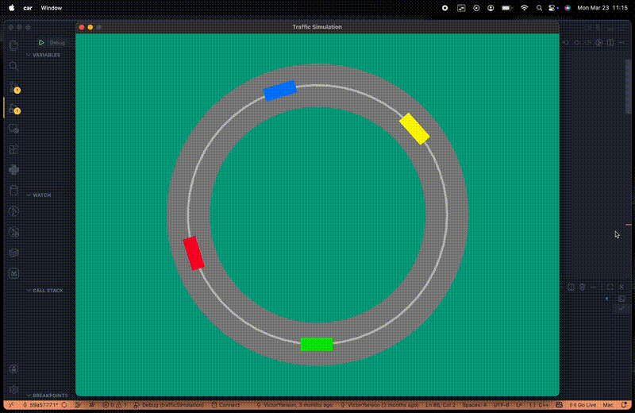

# Traffic Simulation

Traffic Simulation is a driver-behavior simulator that recreates realistic acceleration and braking in a multi-car, single-lane circular scenario. Cars follow each other around a ring road using the Intelligent Driver Model (IDM) for car-following dynamics, with real-time visualization rendered via RayLib.

## Features

- **IDM-based car following**: Acceleration and braking derived from gap to leader, speed difference, desired speed, and configurable time buffer and minimum gap
- **Multi-car ring scenario**: Several cars (configurable count and initial positions) circulate on a circular track
- **Per-car parameters**: Each vehicle has its own starting speed, desired speed, and starting angle
- **Real-time visualization**: 60 FPS rendering of cars and road using RayLib

## Approach

The simulation is built around the Intelligent Driver Model: each car computes its acceleration from the distance to the leading car, its own speed, and a desired gap. Cars update their positions each frame in a leader-follower loop. The road is modeled as a ring with inner and outer radii; lane radii are computed from the road width and lane count. RayLib handles the drawing of the circular road surface, lane markings, and rotating car rectangles.

